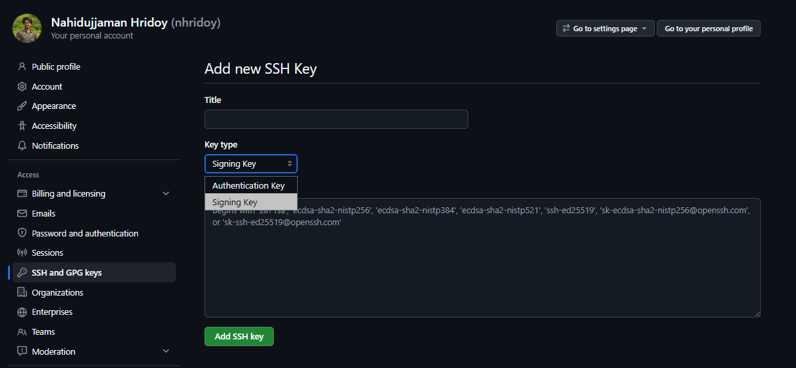

import { Tabs, Steps, Callout } from 'nextra/components'

# Adding Verified Tag to GitHub Commits

Have you ever wondered why does your commit on GitHub shows "Unverified" instead of "Verified"?


Wouldn't it be great if you could add a verified tag to your commits, showing that they are authentic and trustworthy?


Adding a verified tag to your GitHub commits enhances credibility and helps users trust the authenticity of your contributions. In this post, we will explore how to add a verified tag to your GitHub commits using SSH keys.

## What is a Verified Commit?

A verified commit is a commit that has been signed with a GPG key or an SSH key, indicating that the commit was made by a trusted source. This is particularly important in open-source projects where multiple contributors are involved.

## Methods:
1. **Using GPG Keys**: This method involves generating a GPG key and configuring Git to use it for signing commits. It provides a high level of security and is widely supported.

2. **Using SSH Keys**: This method allows you to sign commits using your SSH key, which is often more convenient for developers who already use SSH for authentication with GitHub.

### Using SSH Keys to Sign Commits
In this post, we will focus on how to use SSH keys to sign your commits.

<Steps>
    #### Step 1: Generate an SSH Key (if you don't have one)
    ```bash
    ssh-keygen -t ed25519 -C "your_email@example.com"
    ```
    This command will generate a new SSH key pair. Follow the prompts to save the key and set a passphrase if desired. You can also modify the file name and type of key if you prefer a different configuration.

    #### Step 2: Add Your SSH Key to GitHub
    1. Copy the contents of your public SSH key (usually found at `~/.ssh/id_ed25519.pub`).

    <Tabs items={['linux/mac', 'windows (Git Bash)', 'windows (PowerShell)', 'windows (Command Prompt)']}>
        <Tabs.Tab>
            ```bash
                cat ~/.ssh/id_ed25519.pub
            ```
        </Tabs.Tab>
        <Tabs.Tab>
            ```bash
                cat ~/.ssh/id_ed25519.pub
            ```
        </Tabs.Tab>
        <Tabs.Tab>
            ```powershell
                Get-Content -Path $env:USERPROFILE\.ssh\id_ed25519.pub
            ```
        </Tabs.Tab>
        <Tabs.Tab>
            ```cmd
                type %USERPROFILE%\.ssh\id_ed25519.pub
            ```
        </Tabs.Tab>
    </Tabs>

    2. Go to GitHub > Profile Icon > Settings > SSH and GPG keys > New SSH key.

    

    3. In the "Title" field, add a descriptive name for the key (e.g., "My Laptop SSH Key").
    4. For the "Key Type", select "Signing Key".
    5. Paste the contents of your public SSH key into the "Key" field.
    6. Click "Add SSH key".

    

    #### Step 3: Configure Git to Use Your SSH Key for Signing
    1. Tell Git that you want to use SSH keys for signing commits:
    ```bash
    git config --global gpg.format ssh
    ```
    2. Set your SSH key as the default signing key:
    ```bash
    git config --global user.signingkey ~/.ssh/id_ed25519
    ```
    3. Enable commit signing by default:
    ```bash
    git config --global commit.gpgsign true
    ```

    <Callout type="info">
        (Optional) If you want to sign commits only for a specific repository, navigate to that repository and run the above commands without the `--global` flag. This is neccessary if you have multiple github accounts setup on the same machine and want to use different SSH keys for each account.
    </Callout>

    #### Step 4: Make a Signed Commit
    ```bash
    git commit -S -m "Your commit message"
    ```
    or simply:
    ```bash
    git commit -m "Your commit message"
    ```

    #### Step 5: Verify the Commit on GitHub
    After pushing your commit to GitHub, you should see a "Verified" badge next to your commit in the repository's commit history.
</Steps>

## Conclusion
Adding a verified tag to your GitHub commits using SSH keys is a straightforward process that enhances the credibility of your contributions. By following the steps outlined above, you can ensure that your commits are trusted and recognized as authentic by the GitHub community.